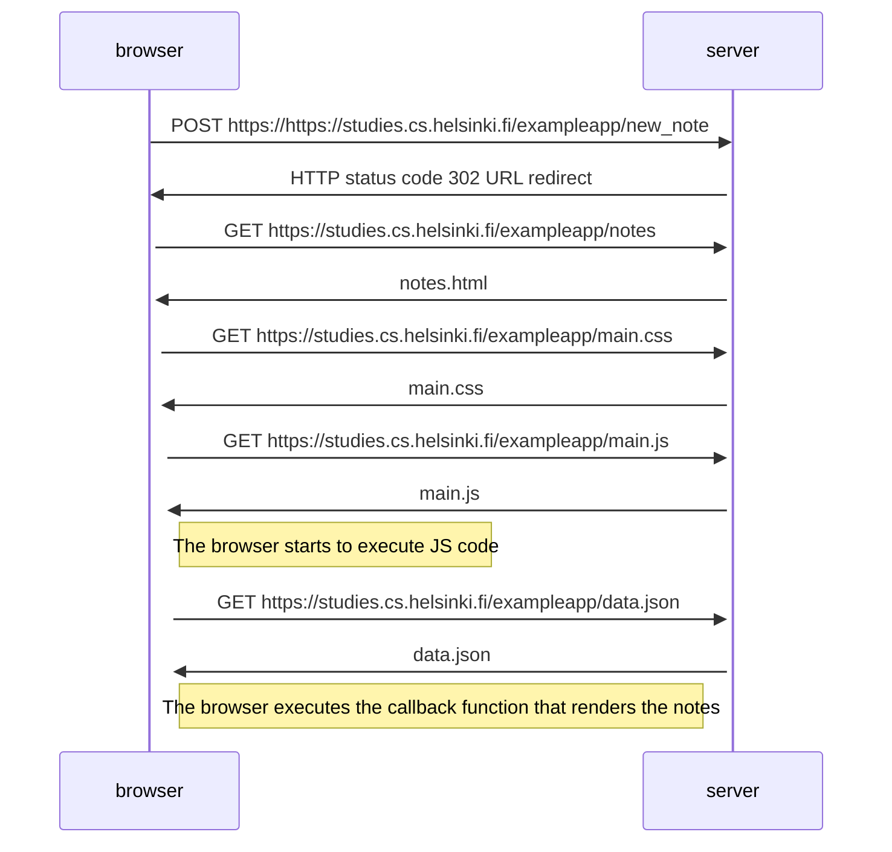

```mermaid
sequenceDiagram

participant browser
participant server

browser ->> server: POST https://https://studies.cs.helsinki.fi/exampleapp/new_note
activate server
server ->> browser: HTTP status code 302 URL redirect
activate browser
browser ->> server: GET https://studies.cs.helsinki.fi/exampleapp/notes
activate server
server ->> browser: notes.html
activate browser
browser ->> server: GET https://studies.cs.helsinki.fi/exampleapp/main.css
activate server
server ->> browser: main.css
activate browser
browser ->> server: GET https://studies.cs.helsinki.fi/exampleapp/main.js
activate server
server ->> browser: main.js
note right of browser: The browser starts to execute JS code
activate browser
browser ->> server: GET https://studies.cs.helsinki.fi/exampleapp/data.json
activate server
server ->> browser: data.json
note right of browser: The browser executes the callback function that renders the notes

```