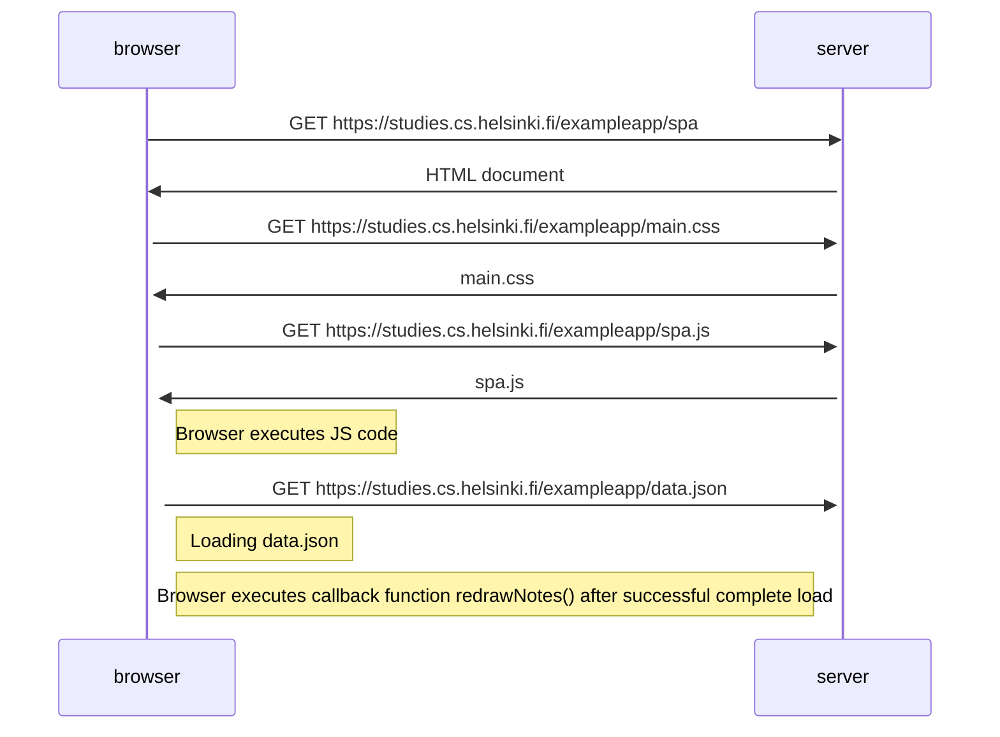

```mermaid
sequenceDiagram

participant browser
participant server

browser ->> server: GET https://studies.cs.helsinki.fi/exampleapp/spa
activate server
server ->> browser: HTML document
activate browser

browser ->> server: GET https://studies.cs.helsinki.fi/exampleapp/main.css
activate server
server ->> browser: main.css
activate browser

browser ->> server: GET https://studies.cs.helsinki.fi/exampleapp/spa.js
activate server
server ->> browser: spa.js
activate browser
note right of browser: Browser executes JS code

browser ->> server: GET https://studies.cs.helsinki.fi/exampleapp/data.json
note right of browser: Loading data.json
note right of browser: Browser executes callback function redrawNotes() after successful complete load
```